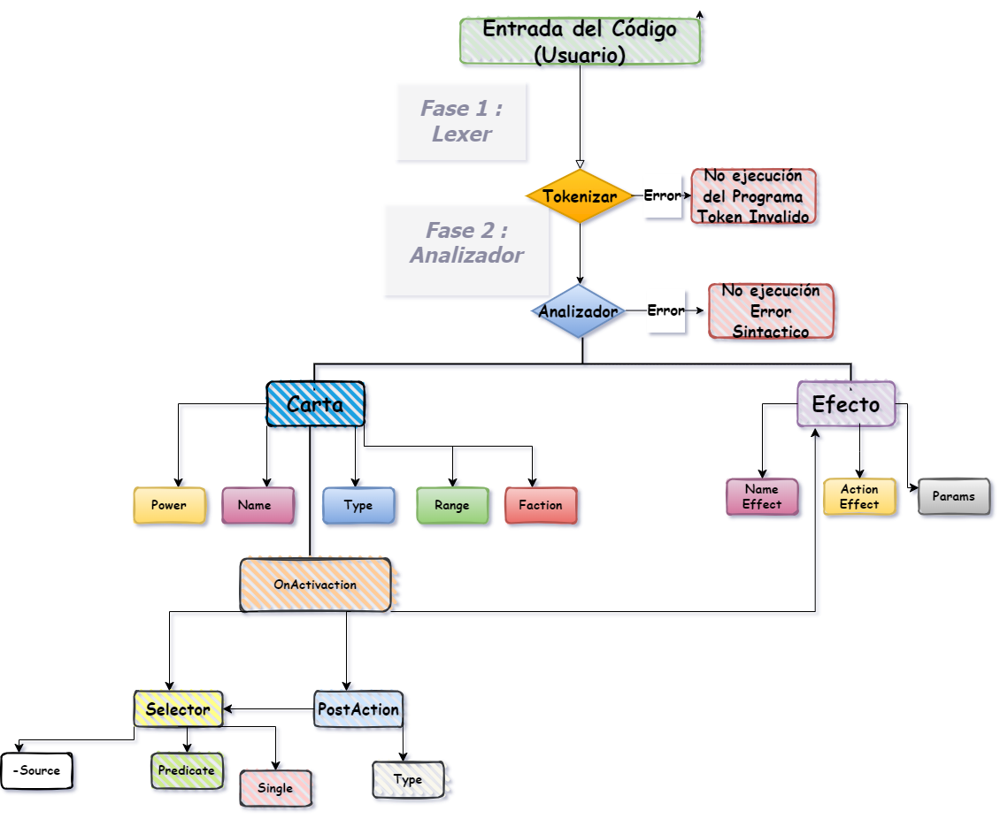

Gwent++ (Compiler)
=============
Este proyecto es la continuacion de :
`<Link del Primer Proyecto>` : <https://github.com/Srdariansitop/Gwent-Project>

El Reto para este Segundo Proyecto fue interpretar el codigo q el Usuario proporciona y a partir de el crear una Carta q sea compatible con la del juego inicial .

# Diagrama de Flujo del Interprete

 

 # Carta
- Power : Se permiten numeros o expresiones numericas
 Example : 
 ```javascript
 Power = 6 
 Power = 5 + 2/3 * 8
 ```
- Name : Se permiten cualquier tipo de String (siempre entre comillas)
 Example :
 ```javascript
Name = "Mewtwo"
 ```
- Type : Debido a la constitucion del juego solo se permiten ciertos tipos de cartas (Gold , Silver , Increase , Clime , Leader )
Example :
```javascript
Type = Gold
```
- Range : Igualmente al tener un juego Base solo se permiten lugares expecificos donde invocar la carta en el campo (Meele , Siege , Distance) , se permite mas de un lugar donde invocar la carta siempre entre [] y con separacion entre ,
Example :
```javascript
Range = [Meele , Siege]
```
- Faction : Solo hay dos tipos de Facciones permitidas (Red , Legend)
Example 
```javascript
Faction = Red 
```
>(Todo estos parametros son obligatorios para q el programa puede formar una Carta)

####Opcional :
+ OnActivaction :
>(Efectos q puedes definir dentro de una partida)

* Selector : 
 * Source : La Fuente donde se pueden deben tomar las Cartas a las q se le aplicaran los efectos  fuentes permitidas son (Deck , OtherDeck , Field , OtherField , Hand , OtherHand) 
 Example :
 ```javascript
 Source = Deck
 ```
 * Single : Un booleano para decidir si me quedo con la primera busqueda en mi Filtro o no (True , False)
Example :
 ```javascript
Single = True
```
  * Predicate : Es el filtro en si por el q van a pasar las cartas del Source 
   Propiedades sobre las cuales se puede filtrar  :
     * unit.power - Se puede comparar con (> , < , >= , <= , == ) ya q al ser entero la                            propiedad Power de las Cartas se puede jugar con todo esto.
      * unit.faction - Con las Facciones ya existentes (Red , Legend)
      * unit.type - Con las Tipos ya existentes (Gold , Silver , Increase , Clime , Leader)
     *   unit.range - Con los espacios en el campo ya existentes (Meele , Siege , Distance )
> (Solo comparacion mediante el ==)

 ```javascript
Example :
Predicate (unit) => unit.power <= 500
```
- PostAction 
>(Efecto que se ejeuta posterior ) :

 *  Type : Tiene q ser un nombre de algun efecto q hayas creado previamente 
  Example :
   ```javascript
  Type = "Draw"
  ```
 * Selector 
 > (Funciona Igualmente q el del OnActivaction con una pequena diferencia en el q el Source puede tomar otro tipo de Fuente (Parent q es una fuente q toma la lista anterior formada en el OnActivaction))

## Example Card Complete  :
   ```javascript
Card
{
Power = 5 + 2/3 * 8
Name ="Mewtwo" 
Faction = Red 
Range = [Meele , Siege] 
Type = Gold 
OnActivation =
[
 Effect
{
Name = "Damage"
}
Selector
{
  Source = Deck
  Single = True
  Predicate (unit) => unit.power <= 500
}
PostAction
{
  Type = "Draw"
  Selector
{
  Source = parent
  Single = False
  Predicate (unit) => unit.faction == Red
}
}
]
}
  ```
